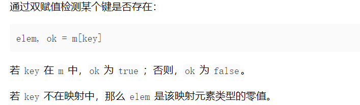

# 0

## Package

Every Go program is made up of packages.

Programs start running in package `main`.

同一个包内的变量相互可见

### import


两种方式是等价的，不过后者会更好一些


### Exported Name

In Go, a name is exported if it begins with a capital letter. 

math.pi 和 math.Pi


## Variable, Function

### Function Formats


返回值在函数名和参数名之后。

如果有多个相同的参数，可以合并：


参数和返回值的声明是有先后顺序的，也就是说，声明完的参数在后面的函数体中不能被重新或重复定义。

可以有多个返回值，返回的变量可以在签名中进行定义，这样最后只需要return，也可以在函数体中声明变量然后return一个对应的变量列表


### Variable

#### Variable Declaration

1. var i int，var i, j int = 1, 2，没有初始化则默认为零值

2. var c, python, java = true, false, "no!" 省略类型，主动推断类型

3. c, python, java := true, false, "no!"，省略 var，如果没有声明新的变量，就产生编译错误

4. ```go
   var (
   	ToBe   bool       = false
   	MaxInt uint64     = 1<<64 - 1
   	z      complex128 = cmplx.Sqrt(-5 + 12i)
   )
   ```

   因式分解定义


#### Variable Type


Go中没有进行强制类型转换的两个变量不能直接赋值，否则会发生错误

常量使用const关键字，必须给出右值，且不能使用:=


## Flow Control

### For

强格式，不需要小括号

while用for代替


### If


可以在判断之前加入一个简短的表达式进行声明，但作用域仅限于if内

else必须和if恶花括号在同一行


### switch

不需要break，用fallthrough代替可能的需要

可以有前置的声明：


#### switch true


### defer

defer 语句会将函数推迟到外层函数返回之后执行。

推迟调用的函数其参数会立即求值，但直到外层函数返回前该函数都不会被调用。


defer的函数会被压入栈中，当外层函数结束后，该函数内部的defer函数会后进先出的执行


## More Types

### Pointer

类似C语言的语法，但是没有指针运算的概念


### Struct


指针和结构体本身的访问方式都是dot


### Array

类型 `[n]T` 表示拥有 `n` 个 `T` 类型的值的数组。

表达式

```
var a [10]int
```

会将变量 `a` 声明为拥有 10 个整数的数组。

数组的长度是其类型的一部分，因此数组不能改变大小。这看起来是个限制，不过没关系，Go 提供了更加便利的方式来使用数组。


### Slide

切片是数组中一段元素的引用


append（）

range（）


### Map

make初始化

```go
var m = map[string]Vertex{
	"Bell Labs": Vertex{
		40.68433, -74.39967,
	},
	"Google": Vertex{
		37.42202, -122.08408,
	},
}
```

插入、修改、删除、取值




### 函数作为参数


参数名 func(函数参数列表) 函数返回值


### 函数闭包

函数绑定在其返回值上，可以引用函数体外的变量，有点像静态局部变量的用法

Fibonacci数列的实现：


## Method and Interface

### Method

Go 没有类。不过可以为结构体类型定义方法。

方法就是一类带特殊的 **接收者** 参数的函数。

方法接收者在它自己的参数列表内，位于 `func` 关键字和方法名之间。


实际上是将v作为参数进行传递，当参数为*Vertex，v被隐式转换成了&v


### Interface

**接口类型** 是由一组方法签名定义的集合。

接口类型的变量可以保存任何实现了这些方法的值。

有点类似于多态。

类型通过实现一个接口的所有方法来实现该接口。既然无需专门显式声明，也就没有“implements”关键字。

隐式接口从接口的实现中解耦了定义，这样接口的实现可以出现在任何包中，无需提前准备。

鸭子辩型：“像鸭子走路，像鸭子叫（长得像鸭子），那么就是鸭子”


### Error


## Concurrency

### Go Routine


### Channel

```go
func sum(s []int, c chan int) {
	sum := 0
	for _, v := range s {
		sum += v
	}
	c <- sum // 将和送入 c
}

func main() {
	s := []int{7, 2, 8, -9, 4, 0}

	c := make(chan int)
	go sum(s[:len(s)/2], c)
	go sum(s[len(s)/2:], c)
	x, y := <-c, <-c // 从 c 中接收

	fmt.Println(x, y, x+y)
}
```

对切片中的数进行求和，将任务分配给两个 Go 程。一旦两个 Go 程完成了它们的计算，它就能算出最终的结果。

信道可以是 *带缓冲的*。将缓冲长度作为第二个参数提供给 `make` 来初始化一个带缓冲的信道：

```go
ch := make(chan int, 100)
```