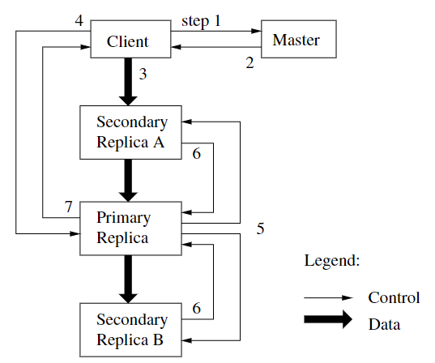

# 3

## System Design

### Why hard

- Performance need sharding, available
- Faults needs tolerance
- Tolerance needs replicaiton
- Replication turn to inconsistency
- consistency means low performance

### Consistency

#### Strong

不管两个写请求谁先被处理，不同的读请求需要看到相同的答案

#### Bad Design

没有对写请求进行顺序处理，不同的Server可能受到不同的写数据顺序

## GFS article

### Characteristic

- Big, fast

- Global

- Sharding

- Autimatic recovering

- single data centor(master)

- internal use

- operation big sequenti al access

- > Used in industry, real-world experience.
  > Successful use of weak consistency.
  > Successful use of single master.

### Structure

- Clients
- Files split into independent 64MB chunks
- Chunkservers, including replicas
- Master

### Master

#### RAM

- filename -> array of  chunk handles
- handle -> list or chunkservers, version, primary, lease expiration
- version and filename info is non-volatile

 #### Disk

- log
- checkpoint

 ### Data and Operation

#### Read

1. C sends filename and offset to master M (if not cached)
2. M finds chunk handle for that offset
3. M replies with list of chunkservers, only those with latest version
4. C caches handle + chunkserver list
5. C sends request to nearest chunkserver, chunk handle, offset
6. chunk server reads from chunk file on disk, returns

#### Record append

1. C asks M about file's last chunk
  2. if M sees chunk has no primary (or lease expired):
     2a. if no chunkservers w/ latest version #, error
     2b. pick primary P and secondaries from those w/ latest version #
     2c. increment version #, write to log on disk
     2d. tell P and secondaries who they are, and new version #
     2e. replicas write new version # to disk
  3. M tells C the primary and secondaries
  4. C sends data to all (just temporary...), waits
  5. C tells P to append
  6. P checks that lease hasn't expired, and chunk has space
  7. P picks an offset (at end of chunk)
  8. P writes chunk file (a Linux file)
  9. P tells each secondary the offset, tells to append to chunk file
  10. P waits for all secondaries to reply, or timeout
      secondary can reply "error" e.g. out of disk space
  11. P tells C "ok" or "error"
  12. C retries from start if error