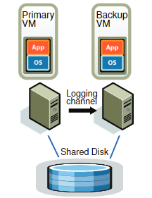
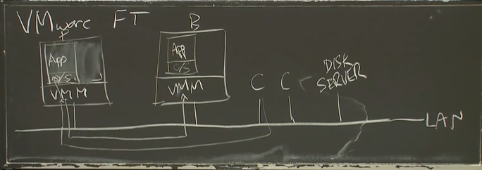
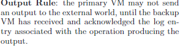

# 4

## vm-ft article

### Two main approach for replication 

- State transfer

  Primary replica executes the service

  Primary sends [new] state to backups

- Replicated state machine

  Clients send operations to primary, primary sequences and sends to backups.

  All replicas execute all operations

  If same start state, same operations, same order, deterministic, then same end state.

  More simple

### What level do we want replicas to be identical?

 machine-level state

### Vmware FT

Shared disk 可以被认为是另一台服务器上的存储设备

input：VMM也就是Hypervisor，将收到的input传到本OS上，也将其传到backup上

output：只有primary给出

log channel：primary和backup的沟通渠道，沟通的信息是log entry

#### When does the primary have to send information to the backup?

- Any time something happens that might cause their executions to diverge.
- Anything that's not a deterministic consequence of executing instructions. 

#### What sources of divergence must FT handle?

Most instructions execute identically on primary and backup.

As long as memory+registers are identical, which we're assuming by induction.

Inputs from external world -- just network packets.

Timing of interrupts.

Instructions that aren't functions of state, such as reading current time.

Not multi-core races, since uniprocessor only.

Each log entry: instruction #, type, data.

#### FT's handling of timer interrupts

  Goal: primary and backup should see interrupt at 
        the same point in the instruction stream
  Primary:
    FT fields the timer interrupt
    FT reads instruction number from CPU
    FT sends "timer interrupt at instruction X" on logging channel
    FT delivers interrupt to primary, and resumes it
    (this relies on CPU support to interrupt after the X'th instruction)
  Backup:
    ignores its own timer hardware
    FT sees log entry *before* backup gets to instruction X
    FT tells CPU to interrupt (to FT) at instruction X
    FT mimics a timer interrupt to backup

#### FT's handling of network packet arrival (input)

  Primary:
    FT tells NIC to copy packet data into FT's private "bounce buffer"
    At some point NIC does DMA, then interrupts
    FT gets the interrupt
    FT pauses the primary
    FT copies the bounce buffer into the primary's memory
    FT simulates a NIC interrupt in primary
    FT sends the packet data and the instruction # to the backup
  Backup:
    FT gets data and instruction # from log stream
    FT tells CPU to interrupt (to FT) at instruction X
    FT copies the data to backup memory, simulates NIC interrupt in backup

### Output Rule

### Split Brain

using client authority

test-and-set

